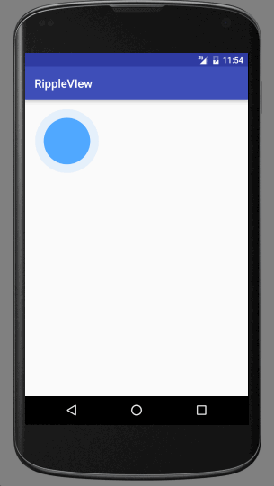

# RippleView
Android 水波纹效果
##DEMO

##USAGE
``` 
<com.czc.max.library.RippleView
        android:id="@+id/rippleView"
        android:layout_width="wrap_content"
        android:layout_height="wrap_content"
        app:rb_content_circle_radius="40dp"/>
```
start animation:
```
 rippleView = ((RippleView) findViewById(R.id.rippleView));
 rippleView.start();
```


